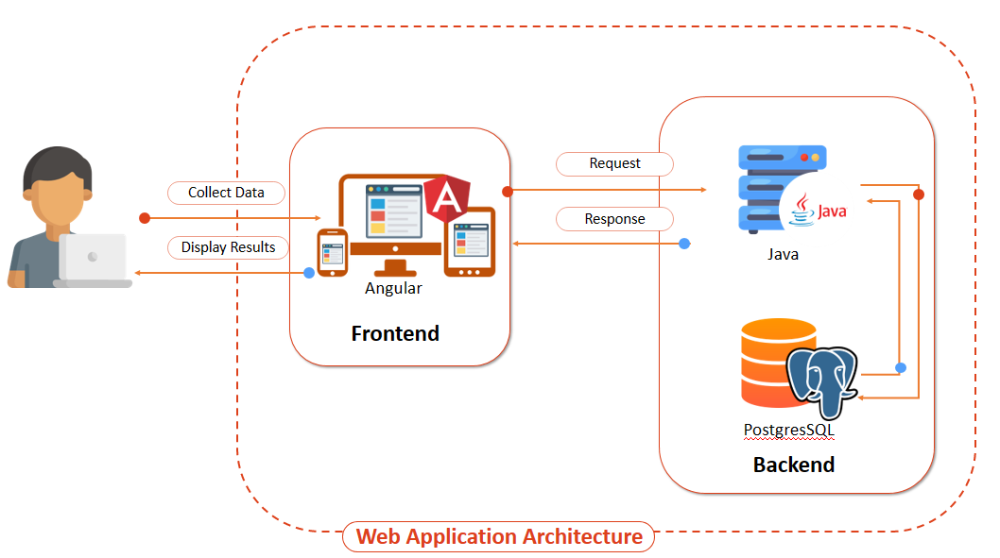
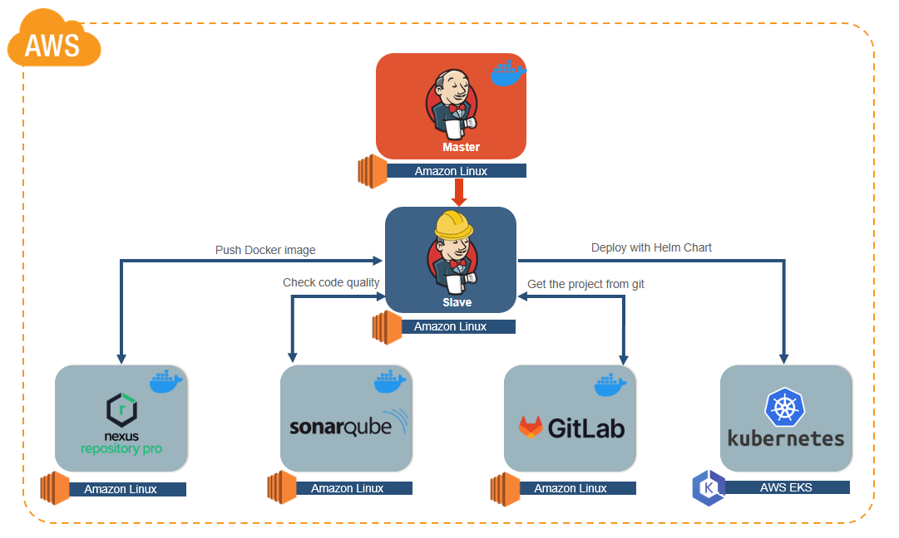
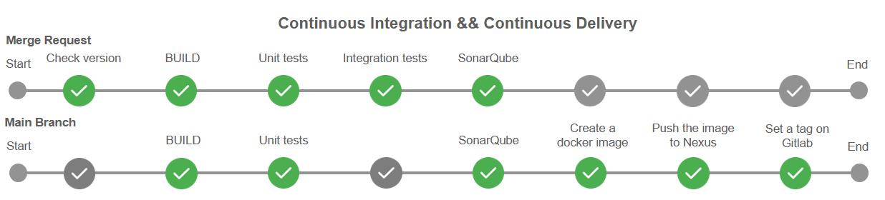

# Jenkins-CI-Pipeline

## Project propose:
> Create one Jenkins pipeline dedicated to both the frontend and the backend web application.

## Application architecture:

The following technologies were used for the web application:
- Frontend - Angular framework;
- Backend - Java.
  

## Infrastructure:
All infrastructure has been deployed in AWS Cloud. 
- Jenkins - CI tool;
- Jenkins Node - was used Amazon EC2 plugin. First, was created AMI with tools and all configuretion and that ami was used for all Pipelines;
- Nexus - used to store Docker artifacts;
- SonarQube - used to check code quality;
- GitLab - distributed version control tool;
- AWS EKS - used to deploy application.
  

## Pipeline steps:
For frontend and backend application i have created Continues Integration, Continues Delivery Pipeline. 

The steps you can see on the slide. 

When Merge Request is open, we check version to be upgraded, build the application and make tests. 

When cod is pushed to the main branch, we create an artifact and push this artifact with newly created tag to Nexus repository and also i push this tag to GitLab repository.

